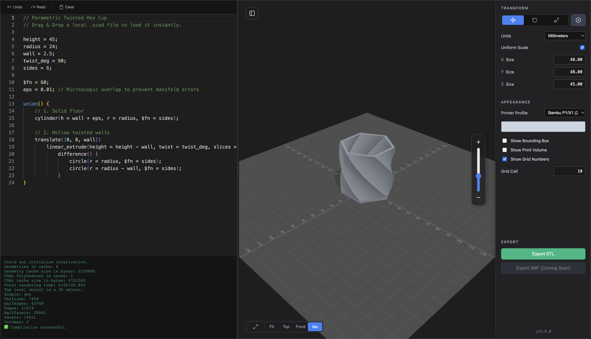

# OpenSCAD Studio (Web)

[](https://dgelormini.github.io/openscad-converter-demo/)
[](https://dgelormini.github.io/openscad-converter-demo/)
[](https://threejs.org/)

A lightweight, modern, client-side web IDE and 3D previewer for **OpenSCAD**. Compile `.scad` scripts directly in your browser with zero installation, manipulate models with 3D interactive gizmos, preview realistic 3D printer build volumes, and export production-ready **STL** and **3MF** files.

🔗 **Live Application:** [https://dgelormini.github.io/openscad-converter-demo/](https://dgelormini.github.io/openscad-converter-demo/)

---



---

## ✨ Features

- **⚡ 100% In-Browser Compilation:** Powered by OpenSCAD WebAssembly (`openscad.wasm`) running in background Web Workers. Your code and models never touch an external server.
- **💻 Monaco Code Editor:** Full-featured VS Code-style editor with syntax highlighting, undo/redo history, error reporting, and auto-compilation with smart debouncing.
- **🎮 Interactive 3D Transform Gizmos:**
  - Translate, Rotate, and Scale directly in the 3D viewport (`T`, `R`, `S` shortcuts).
  - Numeric scrubbing inputs with real-time dimension feedback.
  - Uniform scaling toggle and millimeter / inch unit switching.
- **🖨️ Printer Build Volumes:**
  - Pre-configured profiles for **Bambu Lab P1/X1**, **Prusa MK4**, **Voron v2.4**, and **Prusa Mini**.
  - Dynamic grid sizing with physical measurement numbers and bounding-box toggle.
  - Center-to-bed alignment tool.
- **🎥 Viewport Controls:**
  - Perspective and Orthographic camera projection toggles.
  - Quick camera presets: **Top**, **Front**, and **Isometric (Iso)** views.
  - Smooth OrbitControls with distance-synced zoom slider.
- **📦 Multi-Format Exporters:**
  - **STL (Visual Layout):** Exports the transformed, positioned, and scaled scene geometry.
  - **3MF (Parametric):** Bakes transform matrices cleanly into native OpenSCAD scale wrappers.
- **📁 Drag & Drop Loading:** Drop any local `.scad` file directly onto the canvas to load it instantly.
- **💾 Local Auto-Save:** Automatically persists your code in browser `localStorage` across sessions.

---

## 🚀 Getting Started

### Local Development

No Node.js build steps or npm installations are required—the project uses vanilla ES modules and standard web standards.

1. **Clone the repository:**
   ```bash
   git clone https://github.com/dgelormini/openscad-converter-demo.git
   cd openscad-converter-demo
   ```

2. **Start a local HTTP server:**
   *(An HTTP server is required because browsers block ES Modules and Web Workers over direct `file://` URLs).*

   Run the included script (automatically detects Python 3, Python 2, or npx):
   ```bash
   ./serve.sh
   ```
   Or run manually:
   ```bash
   python3 -m http.server 8000
   # or: npx serve . -p 8000
   ```

3. **Open in browser:**
   Navigate to `http://localhost:8000`.

---

## 🛠️ Tech Stack

- **Editor:** [Monaco Editor](https://microsoft.github.io/monaco-editor/) via Cloudflare CDN
- **3D Engine:** [Three.js](https://threejs.org/) (r160)
- **Compiler:** [OpenSCAD WASM](https://code4fukui.github.io/scad2stl/) (via Emscripten Web Worker)
- **Controls:** Three.js `OrbitControls` & `TransformControls`
- **Exporters:** Three.js `STLLoader` & `STLExporter`

---

## 📄 License

This project is available under the [MIT License](LICENSE) (or proprietary All Rights Reserved depending on your preference).
